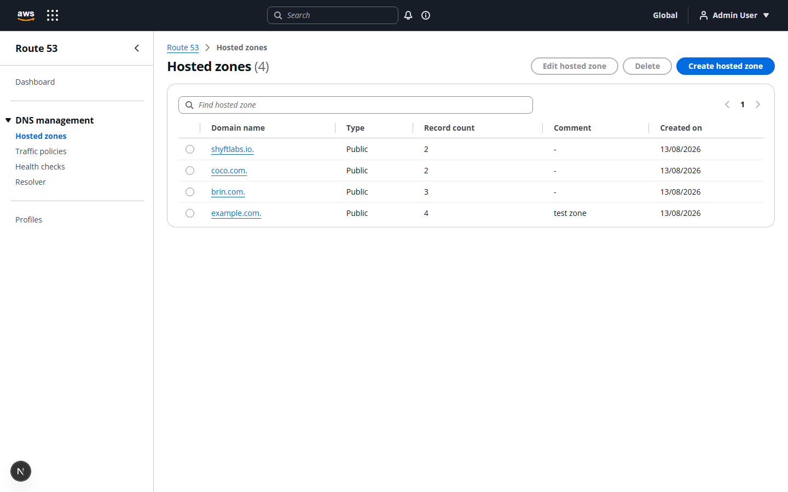
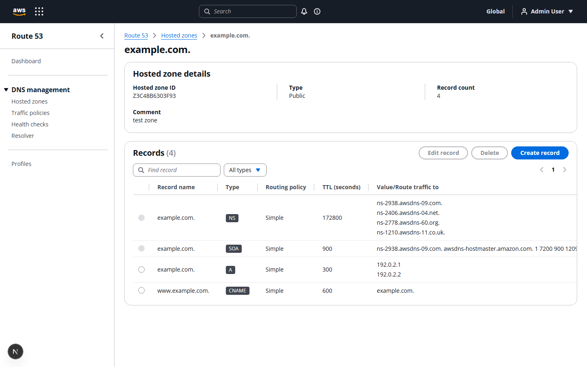

# Route 53 Console Clone

A full-stack clone of the AWS Route 53 console UI/UX — hosted zone and DNS record
management with a mocked authentication layer and persistent storage. Built as a
learning/portfolio project. **Not affiliated with or endorsed by Amazon Web Services.**
DNS records are stored for demonstration only; no real DNS resolution is performed.




## Tech stack

| Layer | Technology |
|---|---|
| Frontend | Next.js (App Router, TypeScript), [Cloudscape Design System](https://cloudscape.design) — AWS's own open-source console component library |
| Backend | FastAPI, SQLAlchemy |
| Database | SQLite |
| Auth | JWT in an httpOnly cookie, mocked credentials (no real IAM/account system) |

## Features

- **Auth**: login, logout, session persistence across page reloads (mocked — one seeded user).
- **Hosted zones**: create, view, search, edit (comment), delete. Deleting a zone is blocked
  while it still contains non-default records, matching Route 53's real behavior. New zones
  automatically get the default `NS` and `SOA` records that Route 53 itself creates.
- **DNS records**: create, view, search, filter by type, edit, delete. Supports `A`, `AAAA`,
  `CNAME`, `TXT`, `MX`, `NS`, `PTR`, `SRV`, `CAA` — including multi-value record sets (e.g. an
  `A` record with several IPs) and a shared TTL per record set, the same model Route 53 uses.
- **Placeholder sections**: Dashboard, Traffic policies, Health checks, Resolver, and Profiles
  render as simple "coming soon" pages, matching the navigation structure of the real console
  without implementing those AWS services.

## Project structure

```
aws_clone/
├── backend/             # FastAPI application
│   └── app/
│       ├── main.py      # app setup, CORS, startup (create tables + seed)
│       ├── models.py    # SQLAlchemy models
│       ├── schemas.py   # Pydantic request/response schemas
│       ├── auth.py      # JWT + password hashing + auth dependency
│       ├── services.py  # default-record generation, delete-guard checks
│       ├── seed.py      # seeds the demo user on first run
│       └── routers/     # auth, hosted-zones, dns-records endpoints
└── frontend/            # Next.js application
    ├── proxy.ts         # route guard (redirects unauthenticated requests)
    ├── lib/              # API client + shared types
    ├── components/       # auth/flashbar context, shared UI
    └── app/
        ├── login/
        └── (app)/        # authenticated shell (top nav + side nav)
            ├── hosted-zones/
            ├── dashboard/, traffic-policies/, health-checks/, resolver/, profiles/
```

## Setup

### Backend

```bash
cd backend
python -m venv venv
venv\Scripts\activate        # Windows; use `source venv/bin/activate` on macOS/Linux
pip install -r requirements.txt
uvicorn app.main:app --reload --port 8000
```

The SQLite database (`route53_clone.db`) and the demo user are created automatically on
first run. API docs are available at `http://localhost:8000/docs`.

### Frontend

```bash
cd frontend
npm install
npm run dev
```

Copy `.env.local.example` to `.env.local` if you need to point at a different backend URL
(defaults to `http://localhost:8000/api`). Open `http://localhost:3000`.

### Demo login

```
Email:    admin@example.com
Password: Admin@12345
```

## Architecture overview

The frontend is a Next.js App Router application that talks to the FastAPI backend purely
over its REST API (no server-side rendering of API data, no Next.js API routes) — every
page is a client component that fetches through `lib/api.ts`. Authentication is a signed JWT
stored in an httpOnly cookie: `proxy.ts` does a cheap presence check to redirect signed-out
visitors before a page renders, and the authenticated layout calls `GET /api/auth/me` as the
authoritative check. The backend is a conventional FastAPI app — routers call SQLAlchemy
directly against SQLite, with request/response validation handled by Pydantic schemas.

## Database schema

**users** — `id`, `email` (unique), `password_hash`, `name`, `created_at`

**hosted_zones** — `id` (AWS-style zone ID, e.g. `Z3C48B6303F93`), `name` (domain name with
trailing dot, unique), `comment`, `zone_type` (`Public`/`Private`), `created_at`, `updated_at`.
Name and type are immutable after creation, matching Route 53.

**dns_records** — `id`, `hosted_zone_id` (FK), `name`, `record_type`, `ttl`, `values` (JSON list
of strings), `is_default` (true for the auto-created `NS`/`SOA` records), `created_at`,
`updated_at`. Unique on `(hosted_zone_id, name, record_type)` — one row per record set, matching
how Route 53 groups multiple values under one name + type.

## API overview

All endpoints are under `/api` and require the session cookie (except `/api/auth/login`).
List endpoints return `{ items, total }` and accept `search` / `page` / `page_size` query params.

| Method | Path | Description |
|---|---|---|
| POST | `/api/auth/login` | Authenticate, set session cookie |
| POST | `/api/auth/logout` | Clear session cookie |
| GET | `/api/auth/me` | Current user |
| GET, POST | `/api/hosted-zones` | List (search + pagination) / create a hosted zone |
| GET, PUT, DELETE | `/api/hosted-zones/{id}` | Get / update comment / delete a hosted zone |
| GET, POST | `/api/hosted-zones/{id}/records` | List (search + type filter + pagination) / create a record |
| GET, PUT, DELETE | `/api/hosted-zones/{id}/records/{record_id}` | Get / update / delete a record |

Full interactive documentation is generated by FastAPI at `/docs`.
